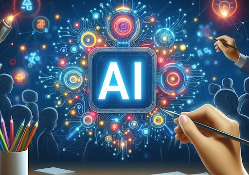

  

# AI Spark
_Just like a spark can ignite a fire, the AI Spark course is designed to inspire a passion 
for learning and discovery in the fascinating world of artificial intelligence_

_(This course is under development for 2024 with the goal to provide local high school students a free,
instructor guided, introduction to the field of artificial intelligence and machine learning.)_

## Description
AI Spark is an introduction to Artificial Intelligence and Machine Learning that is designed 
to be accessible to students with no prior experience in the field. The course is designed to be hands-on 
and interactive, with a focus on entry level code and applications. It is designed to provide a jumping off
point for students who are interested in learning more about AI and ML and might want to explore the field further.

The slides for this course can be accessed through Google Slides at the following link:
> [AI Spark Course on Google Slides](https://docs.google.com/presentation/d/1WyqNtM9D4BvyC9ExFc4iER9P9pQDchHCU-Yl41997SI/edit?usp=sharing)

## Who is this course for?
This course is designed for high school students who are interested in learning more about artificial intelligence
and the opportunities available in the field. The course is designed to be accessible to students with no prior
experience in the field, and limited coding and mathematics background.

## Using the Github Repository
This repository is designed to be cloned into a simple Jupyter Notebook environment, such as Google Colab. Each lesson
is self-contained in a separate package that aligns with the slides of the course. The lessons are designed to be
interactively run by the students, with the instructor guiding the students through the code and concepts.
